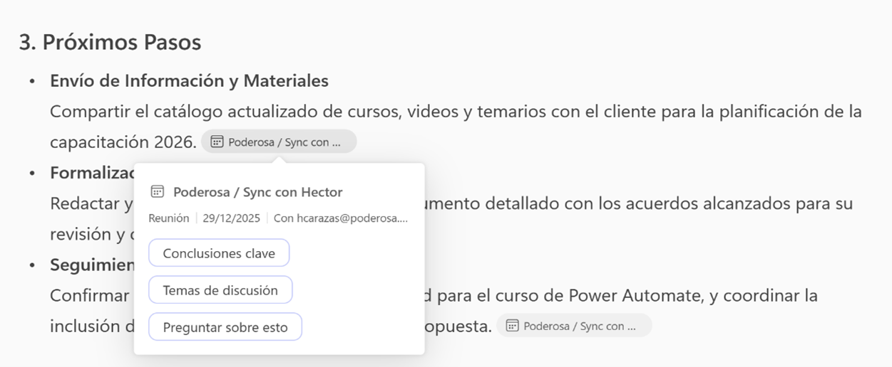
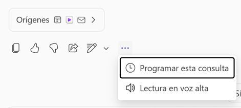
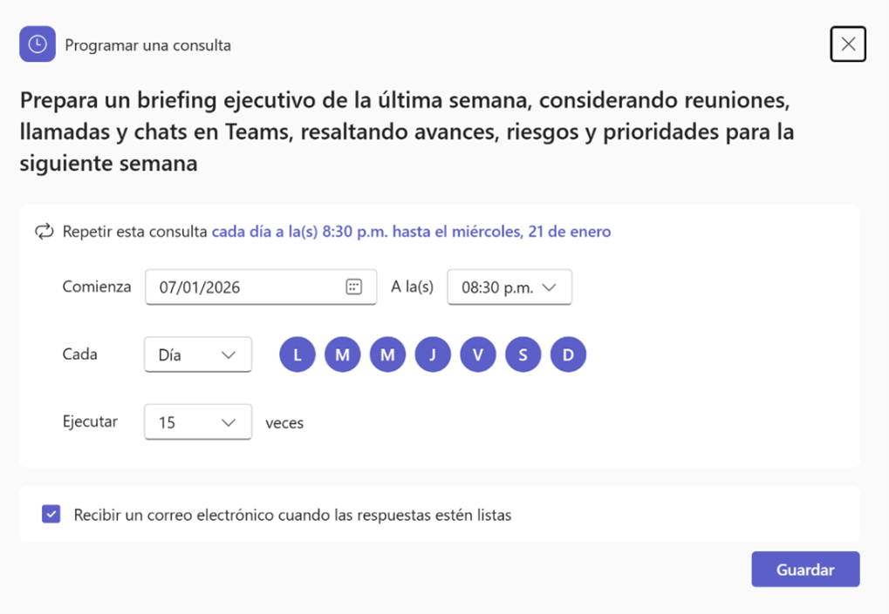
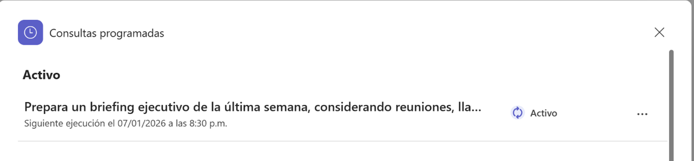
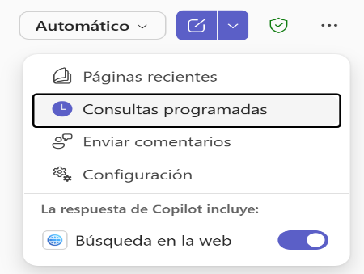
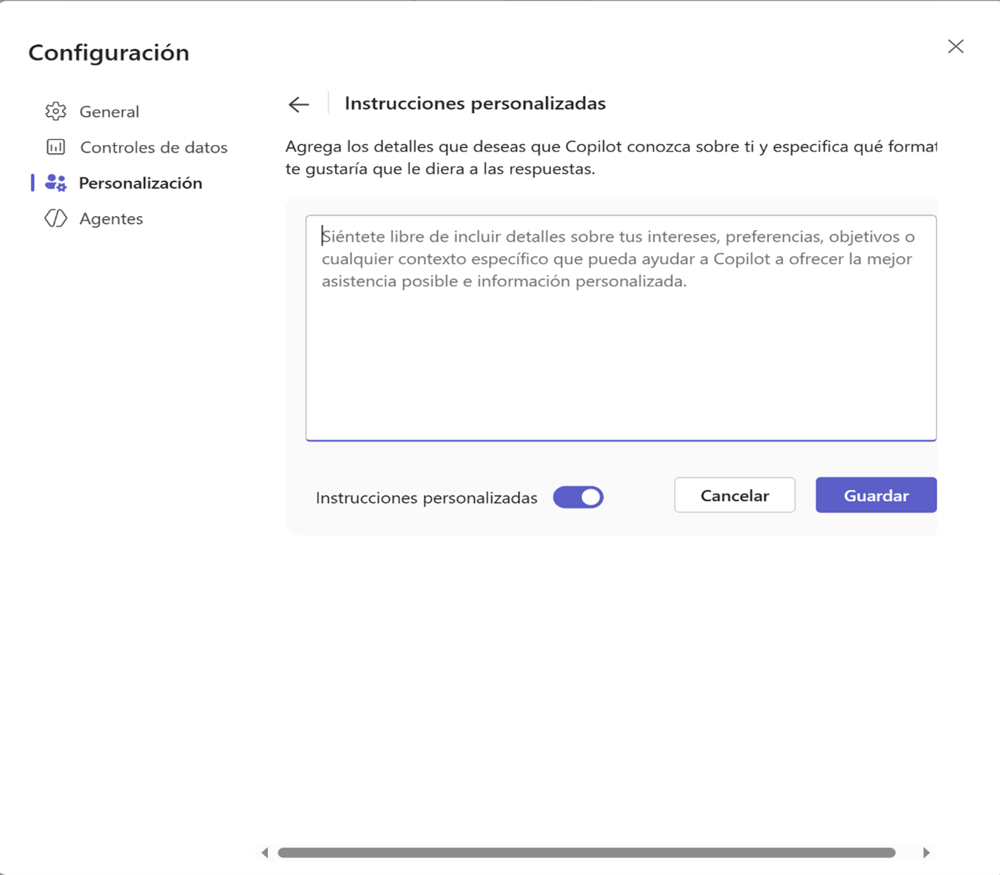

### Laboratorio 1: Teams: Resumen ejecutivo semanal

**Duración:** 22 minutos

## Descripción General
En este laboratorio, aprenderás a utilizar Microsoft 365 Copilot en Teams y Microsoft 365 Copilot Chat para generar un resumen semanal en PDF con prompts programadods. 

## Objetivos de Aprendizaje
Al completar este laboratorio, serás capaz de: 

-Elaborar resúmenes de actividades usando Microsoft 365 Copilot Chat 

-Elaborar resúmenes de actividades usando Microsoft 365 Copilot en Teams 

## Prerrequisitos

### Conocimientos Requeridos
- Conocimiento básico de Microsoft Teams (creación de reuniones, llamadas, uso de chat) 

## Instrucciones Paso a Paso

### Ejercicio 1:  Generar resumenes semanales desde Teams
**Objetivo:**  Usar Copilot de Teams para crear un resumen ejecutivo de las actividades realizas en la semana y generar un documento con el resumen.

**Instrucciones:**
1. Abrir **Teams**.
2. Seleccionar opción Copilot del menú lateral. 
3. Espera que cargue correctamente la ventana integrada de Copilot Chat en Teams 
4. Escriba el siguiente prompt y aplíquelo: 

``` 
Genera un resumen ejecutivo de mis actividades de la última semana en Microsoft Teams, incluyendo reuniones, llamadas y chats grupales. Destaca los temas estratégicos, decisiones clave y próximos pasos. 
```

Revisa el resultado obtenido (imagen referencial) 


Tambien podrás revisar los ítems o enlaces que se muestran en los resultados, por ejemplo (imagen referencial): 



5. Escribe el siguiente prompt 
```
entregame la respuesta en un pdf descargable
```

6. Descarga y revisa el documento PDF proporcionado (imagen referencial)


7. Ahora aplica los siguientes prompts alternativos para obtener diferentes tipos de resúmenes;

| # | Objetivo ejecutivo        | Prompt |
|---|---------------------------|--------|
| 1 | Decisiones y acuerdos | ```Resume las actividades de la semana pasada en Teams y resalta únicamente las decisiones tomadas, acuerdos alcanzados y responsables asignados.``` |
| 2 | Seguimiento gerencial | ```Dame un resumen semanal de mis interacciones en Teams (reuniones, llamadas y chats), enfocándote en compromisos asumidos, pendientes y riesgos identificados. ```|
| 3 | Vista por iniciativas | ```Resume mi semana en Teams agrupando las actividades por temas o iniciativas principales, incluyendo reuniones, chats grupales y llamadas relevantes.``` |
| 4 | Reuniones clave | ```Genera un resumen de las reuniones más importantes que tuve esta semana en Teams, indicando objetivo, principales conclusiones y acciones acordadas. ```|
| 5 | Productividad ejecutiva | ```Analiza mis actividades de la última semana en Teams y entrégame un resumen enfocado en productividad, indicando en qué temas o equipos se concentró la mayor parte del tiempo. ```|
| 6 | Reporte para gerencia | ```Crea un resumen semanal de mis actividades en Teams que pueda compartirse con la gerencia, destacando avances, bloqueos y próximos hitos. ```|
| 7 | Coordinación de equipos | ```Resume mis interacciones en Teams durante la última semana, poniendo énfasis en coordinación con equipos, conversaciones interáreas y puntos de alineamiento.``` |
| 8 | Accionables |``` A partir de mis reuniones, llamadas y chats en Teams de la semana pasada, genera un listado claro de accionables, responsables y fechas estimadas.``` |
| 9 | Briefing ejecutivo | ```Prepara un briefing ejecutivo de mi semana en Teams (máximo una página), incluyendo resumen general, decisiones clave y prioridades para la siguiente semana.``` |

Revisa el resultado en cada caso, refina el prompt de ser requerido para obtener un resultado mas preciso para tu caso.

### Ejercicio 2:  Generar resumen ejecutivo semanal con Microsoft 365 Copilot Chat
**Objetivo:**  Usar Copilot Chat para crear un resumen ejecutivo de las actividades realizas en la semana y generar un documento con el resumen.

**Instrucciones:**
1. Abrir Microsoft 365 Copilot Chat

2. Espera que cargue correctamente la ventana integrada de Copilot Chat en Teams

3. Escriba el siguiente prompt y aplíquelo:
```Prepara un briefing ejecutivo de la última semana, considerando reuniones, llamadas y chats en Teams, resaltando avances, riesgos y prioridades para la siguiente semana```

Revisa el resultado obtenido

4. En los botones que aparecen debajo del resultado, seleccione el botón con puntos suspensivos  ``` (…) ``` y la opción``` “Programar esta consulta” ```(imagen referencial):



5. Aparecerá la ventana **“Programar una consulta”** (imagen referencial):

6. Configurar la recurrencia según se requiera **(Comienza, Cada**, etc). Tambien se puede definir el numero de veces que se ejecutará la consulta. Verifique que la casilla **“Recibir un correo electrónico cuando las respuestas estén listas”** este marcado.Finalmente de clic en **Guardar** (imagen referencial)



7. Aparecerá la ventana **“Consultas programadas”** indicando que la entrada se encuentra creada y en estado **“Activo”** (imagen referencial):



8. Para poder ingresar a esta ventana también podrá usar la opción **“Consultas programadas”** ubicada en el menú superior derecho de su ventana:



**Nota:** Cada vez que se ejecute la consulta le llegará un correo informativo con un enlace, que le llevará al resultado correspondiente desde la ventana de Copilot.

9. Ingrese el siguiente prompt y envíelo, tome nota de la respuesta obtenida:

``` 
Analiza mi actividad semanal en Teams y entrégame un resumen ejecutivo indicando en qué temas, proyectos o equipos se concentró la mayor parte del tiempo. 
```

10. Usando el menú mostrado en el paso previo, seleccione la opción **Configuracion**, luego seleccione la opción **Personalización**, debe ver una ventana similar a la slguiente (imagen referencial)



11.   En el campo de texto ingrese el siguiente texto como prueba:

```
Escribe en un tono conversacional pero profesional. Prioriza la claridad y simplicidad. Usa encabezados y viñetas cuando sea apropiado para hacer el contenido mas fácil de leer. Cambia de punto de vista dependiendo del contexto. Simula el estilo informativo y atrayente de Anthony Bourdain, pero mantén el lenguaje apropiado para todas las audiencias. 
```

12.   Verifica que este activa la opción Instrucciones personalizadas. Haz clic en **Guardar**

13.   Vuelve a ingresar el prompt del paso 9, compara la respuesta con la obtenida hace un momento.

### Ejercicio 3  (opcional): Programando otra instrucción de resumen

1. Siguiendo el procedimiento ya aprendido, usa algún otro prompt de resumen y programa esta instrucción con la periodicidad que desees.

Algunas sugerencias de prompt son:

 ``` 
a.      Genera un resumen ejecutivo de mis interacciones en Teams durante la última semana, enfocándote en coordinación entre equipos, alineamiento interáreas y puntos de fricción
b. Elabora un resumen ejecutivo de mi semana en Teams e identifica los accionables prioritarios que deben atenderse en los próximos días.
c. Crea un resumen ejecutivo tipo one-pager de mi semana en Teams, incluyendo: visión general, decisiones clave, temas críticos y prioridades para la siguiente semana. 

```
