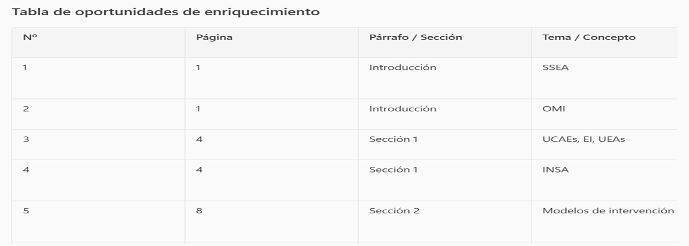
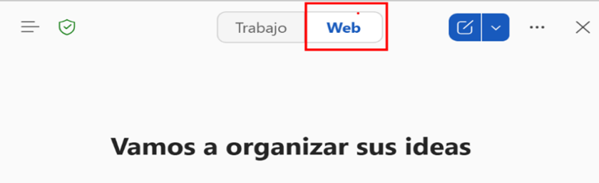
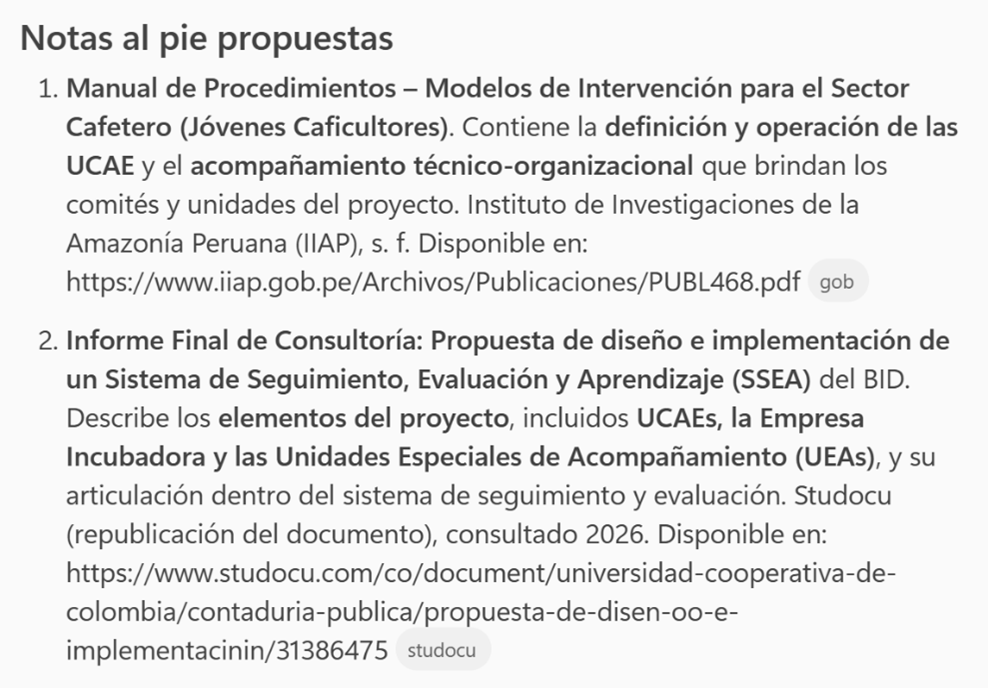
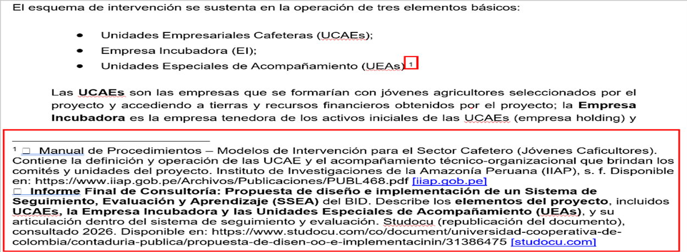
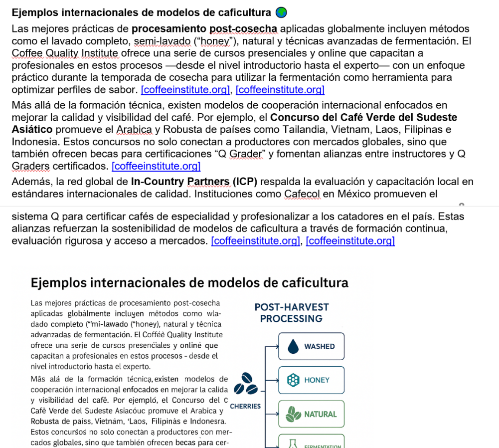
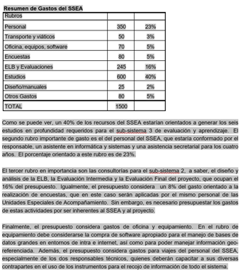
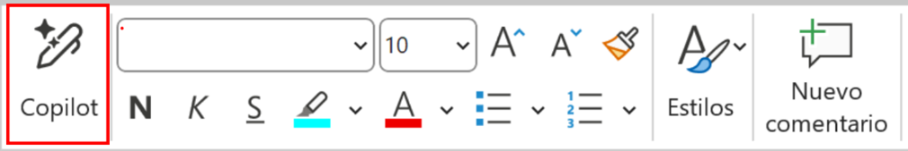
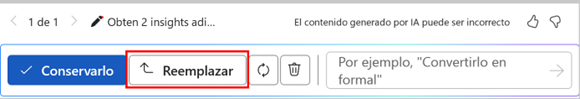

### Laboratorio 2: Word + Copilot – Generación de reporte final

**Duración:** 22 minutos

## Descripción General
En este laboratorio, aprenderás a utilizar Copilot en Word para crear un informe final con insights adicionales, utilizando información obtenida desde la web.

## Objetivos de Aprendizaje
Al completar este laboratorio, serás capaz de:
- Enriquecer un informe de Word con insights adicionales utilizando información de la web mediante Copilot para Word.

## Prerrequisitos

### Conocimientos Requeridos
- Conocimiento básico de Microsoft Word para la edición de documentos.

## Instrucciones Paso a Paso
En estos ejercicios se emplearán una serie de documentos base, los cuales estarán disponibles en el OneDrive de su máquina virtual de prácticas.

Los documentos a disposición son los siguientes:
- **1Informe.docx** (28 páginas)

### Ejercicio 1: Enriquecer un informe con insights de la web usando Copilot para Word

**Objetivo:**  
Usar Copilot para crear un resumen básico de una reunión realizada y enriquecer el documento con información adicional obtenida desde la web.

**Instrucciones:**

1. Abrir **Microsoft Word**.
2. Abrir el documento **1Informe.docx**.
3. Seleccionar la opción **Copilot** desde el menú lateral.
4. Escriba el siguiente prompt:
```
Resume el documento en 3 parrafos, a nivel ejecutivo
```
Puede leer el resumen para tener mejor contexto de que trata el informe.

5. Escriba el siguiente prompt:

```
Identifica 10 ubicaciones del documento que podrían enriquecerse con:
- Insights adicionales para complementar lo indicado.
- Referencias a sitios web para explicar acrónimos, instituciones, marcas, productos o conceptos
- Referencias web a citas indicadas en el documento
```
```

Resume en una tabla los hallazgos, indica la pagina y parrafo en la que se encuentra el texto a enriquecer

```
Debe obtener un resultado similar al siguiente (imagen referencial):



6. En la página 4, bajo el titulo **Seccion 1. Los elementos del proyecto**, busque y seleccione el siguiente texto:

•  Unidades Empresariales Cafeteras (UCAEs);
•  Empresa Incubadora (EI);
•  Unidades Especiales de Acompañamiento (UEAs).

7. En el panel de Copilot seleccione la opción Web de la parte superior (imagen referencial):



8. Escriba el siguiente prompt:
```
Para el texto seleccionado busca 2 referencias en la web
```

9. Copia las notas al pie propuestas (imagen referencial):



10.   Retorne al documento, en el ribbon Referencias seleccione Inserta nota al pie. Pegue las referencias copiadas.

El resultado final puede quedar como se muestra a continuación (imagen referencial):



11.   Ubiquese en la pagina 8, sección 2, debajo del texto:

De otro lado, el esquema de evaluación y seguimiento deberá tener presente los tres principales resultados esperados del proyecto de acuerdo al Marco Lógico, a saber:

•  Aumento en la productividad total de los factores de producción en la caficultura nacional;

•  Inicio autónomo de la réplica de los modelos de intervención por parte de los Comités Departamentales de Cafeteros.

•  El Valor Presente Neto Financiero ex post de los modelos de negocio implementados por los jóvenes asociados en nuevas empresas será significativamente superior con respecto a los testigos;

12.   Inserte unas lineas debajo del texto previo para hacer un espacio.

13.   En el panel de Copilot escriba el siguiente prompt:

```

Crea una seccion con titulo "Ejemplos internacionales de modelos de caficultura" tomando la informacion del sitio web https://www.coffeeinstitute.org/


el texto debe tener una extension maxima de 3 parrafos, de ser posible incluye una imagen informativa para completar la seccion

```
14.   Copie el texto entregado por Copilot en el documento. También copie la imagen generada debajo. El resultado final podria ser similar al siguiente (imagen referencial):



15.   Ubiquese en la pagina 26, en la seccion donde aparece el cuadro **“Resumen de Gastos del SSEA”**

16.   Seleccione la tabla y los 3 párrafos que le siguen, desde “Como se puede ver, un 40%...” hasta “…en el uso de instrumentos para el recojo de informacion de todo el sistema”.
A continuación una imagen referencial para mostrar la zona que debe ser seleccionada:





17.   Usando la botonera flotante seleccione Copilot y escriba el siguiente prompt:
**Obten 2 insights adicionales a los indicados con relacion a la tabla “Resumen de Gastos del SSEA”**

18.   Revise los insights generados. Seleccione el botón **Reemplazar**



19.   Guarde el documento.
