### Laboratorio 8: Microsoft 365 Copilot: Uso de Agentes del Agent Store

**Duración:** 30 minutos

## Descripción General
En este laboratorio, aprenderás a utilizar Microsoft 365 Copilot Chat para usar agentes built-in como Researcher, Analyst, Idea, Writing Coach, Skills, Career, Learning para diferentes escenarios.


## Objetivos de Aprendizaje

Al completar este laboratorio, serás capaz de:

•  Usar diferentes agentes disponibles en el Agent Store de Microsoft 365 Copilot, empleándolos para diferentes casos de uso.


## Prerrequisitos

### Conocimientos Requeridos
-  Conocimiento básico en el uso de documentos de Office con herramientas de Word, Excel, PowerPoint.

## Instrucciones Paso a Paso

En estos ejercicios se emplearán una serie de documentos base, que estarán disponibles en el One Drive de su maquina virtual de practicas.

Los documentos a disposición son los siguientes:

•  6Situación Inmobiliaria México – Primer semestre 2024.pdf


### Ejercicio 1:  Uso del agente Researcher

**Objetivo:** Usar Researcher para buscar, sintetizar y citar fuentes confiables; luego interpretar tendencias con formatos claros y una recomendación ejecutiva.


**Instrucciones:**

1. Abra Microsoft 365 Chat (https://m365.cloud.microsoft/chat)

2. En el menu Izquierdo lateral seleccionar la opción All agents. Se abrirá la página Agent Store, similar a que se muestra a continuación:

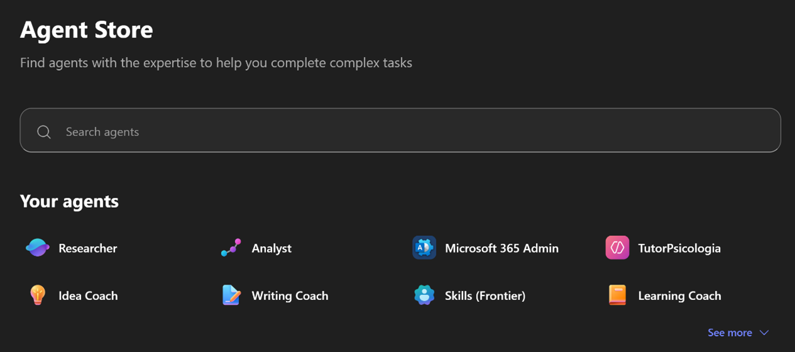


3. Seleccionar el agente Researcher.


4. Debe aparecer la página de agente Researcher.

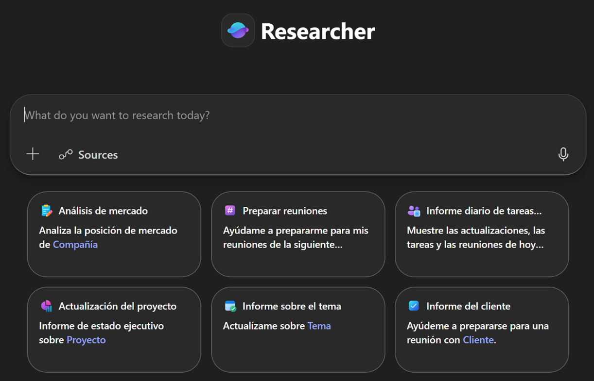

5. Aplique el siguiente prompt:

```
Actúa como analista de tendencias de mercado. Busca las 5 fuentes más recientes y confiables sobre tendencias de consumo digital en Mexico (últimos 12–18 meses). Devuelve un resumen comparativo con citas y marca fecha de publicación y tipo de fuente (reporte, artículo, nota técnica).
```

6. Observe el resultado. Podria ser similar al siguiente (imágenes referenciales):

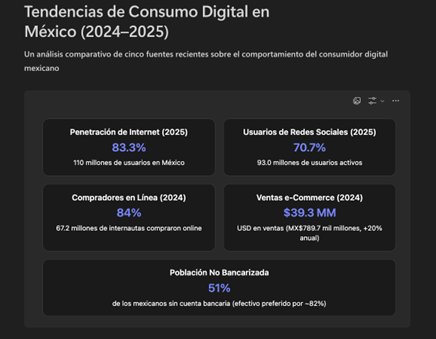

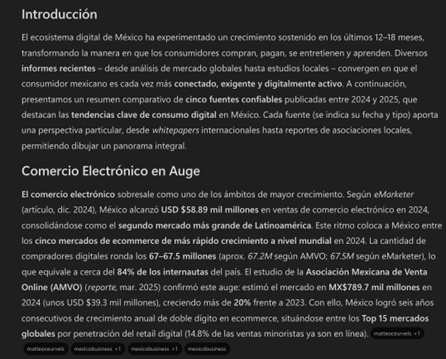

7. Aplique el siguiente prompt:

```
Crea un resumen ejecutivo con los tres escenarios y sus recomendaciones basado en las fuentes encontradas.
```

8. Observe la respuesta entregada, puede ser similar a la siguiente (imagen referencial):

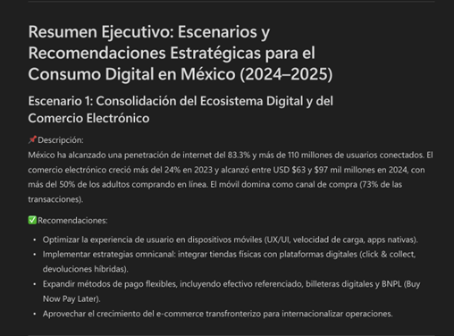

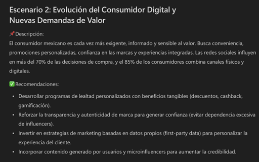

9. Aplique el siguiente prompt 


```
A partir del documento /6Situación Inmobiliaria México – Primer semestre 2024.pdf y las recomendaciones generadas en los escenarios anteriores, identifica los principales riesgos asociados.

```

**Nota:** para este prompt debe adjuntar o referenciar el documento indicado **6Situación Inmobiliaria México – Primer semestre 2024.pdf**

10.   Observe la respuesta que entregue Copilot:

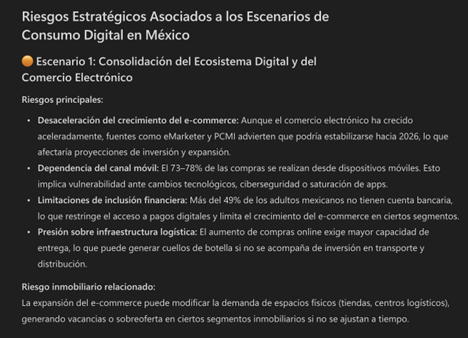

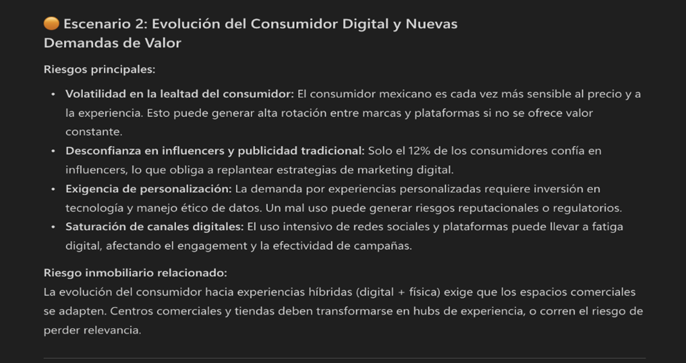

11.   Aplique el siguiente prompt 

```
Busca fuentes recientes (últimos 12 meses) que comparen herramientas de gestión de proyectos.
```
12.   Observe la respuesta que entregue Copilot (imagen referencial):

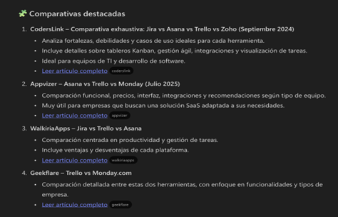


### Ejercicio 2:  Uso del agente Analyst

**Objetivo:** Usar diferentes agentes disponibles en el Agent Store de Microsoft 365 Copilot, empleándolos para diferentes casos de uso.


**Instrucciones:**

1. Abra Microsoft 365 Chat (https://m365.cloud.microsoft/chat)

2. En el menu Izquierdo lateral seleccionar la opción All agents. Se abrirá la página Agent Store, similar a que se muestra a continuación:


3. Seleccionar el agente Analyst.

4. Debe aparecer la página de agente Analyst.

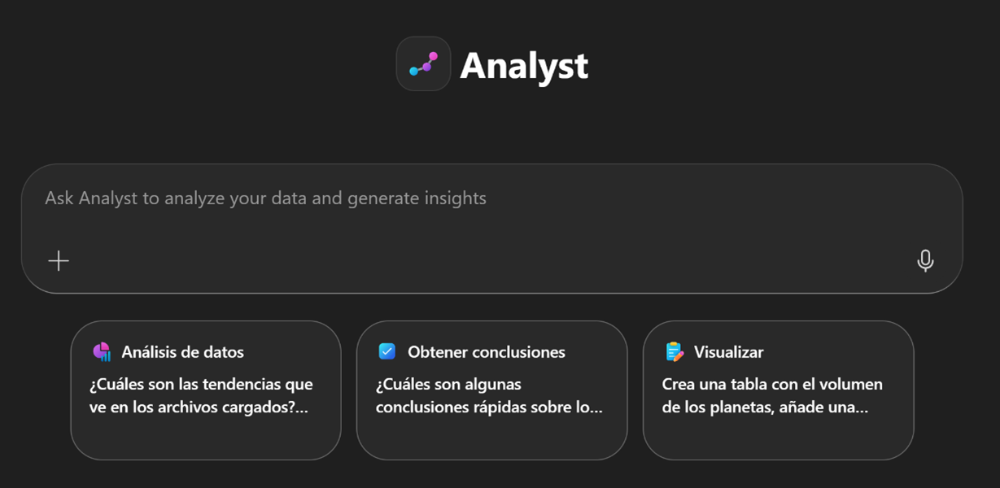


5. Agregue el documento 6Situación Inmobiliaria México – Primer semestre 2024.pdf. Aplique el siguiente prompt:

```
Resume los conceptos técnicos del documento
```

6. Observe como Copilot analiza y muestra su proceso de razonamiento, para finalmente entregar una respuesta (imágenes referenciales):

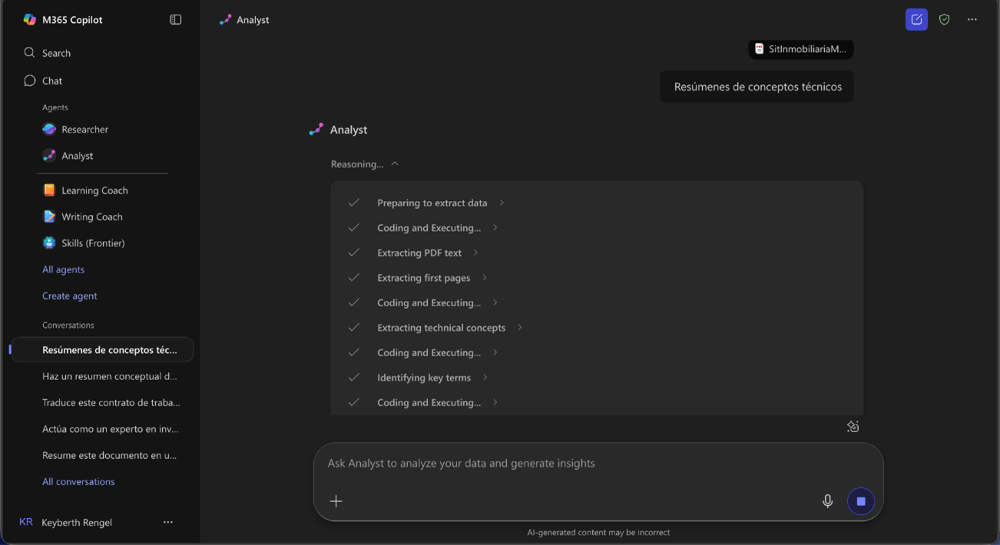

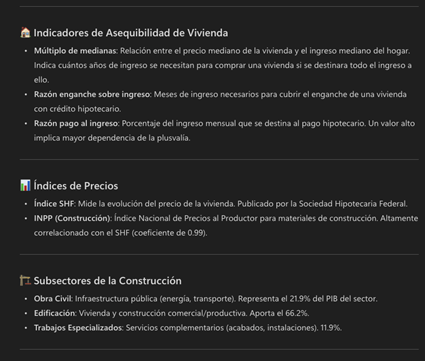

7. Aplique ahora el siguiente prompt:

```
Actúa como analista de tendencias y predice cómo cambiará el comportamiento del consumidor en los próximos 2 años, basándote en el documento
```


8. Observe el resultado que entrega Copilot (imagen referencial):

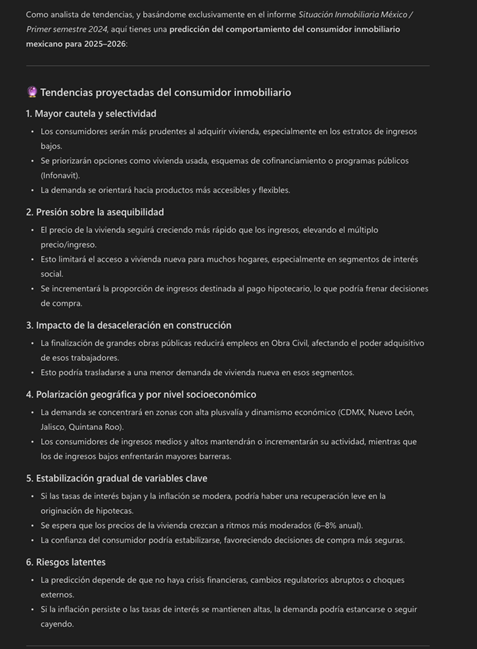

9. Aplique ahora el siguiente prompt:

```
Actúa como un analista de mercado.
Compara dos estrategias de lanzamiento de producto:

•  Lanzamiento presencial en tiendas físicas.
•  Lanzamiento digital con redes sociales y tienda online.

Evalúa ambas opciones según los criterios Costo, Alcance, Tiempo de implementación, Riesgo y Retorno estimado.

Presenta la información en formato de tabla comparativa y finaliza con una recomendación breve
```


10.   Observe el resultado que entrega Copilot (imagen referencial):

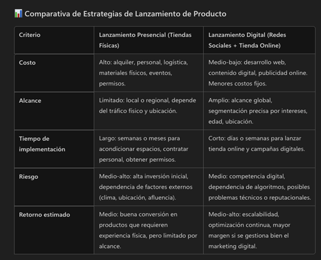

11.   Aplique ahora el siguiente prompt:

```

Evalúa los pros y contras de implementar una nueva estrategia de ventas digital en una empresa mediana, considerando factores como costos, alcance, personal y rentabilidad.
```


12.   Observe el resultado que entrega Copilot (imagen referencial):


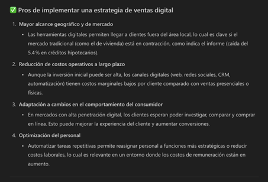

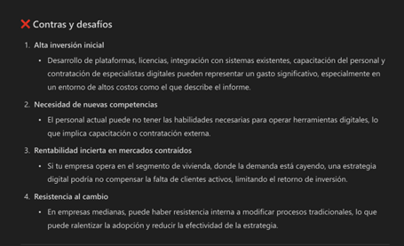

13.   Aplique ahora el siguiente prompt:

```
Analiza las ventajas de migrar de infraestructura local (servidores on-premise) a la nube en estos aspectos:
- Costos
- Escalabilidad
- Seguridad
- Continuidad del negocio
- Innovación y tiempo de salida al mercado

Devuelve la respuesta en una tabla con columnas:

Aspecto | Situación con servidores locales | Ventajas al migrar a la nube | Comentario práctico.

Termina con una conclusión breve (máx. 100 palabras) explicando por qué una empresa mediana debería considerar la migración.
```


14.   Observe el resultado que devuelve Copilot (imagen referencial):


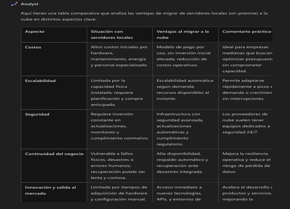

### Ejercicio 3:  Uso del agente idea

**Objetivo:** Usar diferentes agentes disponibles en el Agent Store de Microsoft 365 Copilot, empleándolos para diferentes casos de uso.


**Instrucciones:**

1. Abra Microsoft 365 Chat (https://m365.cloud.microsoft/chat)

2. En el menu Izquierdo lateral seleccionar la opción All agents. Se abrirá la página Agent Store, similar a que se muestra a continuación:


3. Seleccionar el agente Idea.

4. Debe aparecer la página de agente Idea.

5. Aplique el siguiente prompt:


```
A partir del contenido del PDF “Situación Inmobiliaria México – Primer semestre 2024”, genera:

•  2 analogías y 2 metáforas que ayuden a entender cómo se comporta el mercado inmobiliario y de la construcción.
•  En cada analogía, explica qué parte del informe ayuda a comprender mejor y qué limitaciones tiene la comparación.

Finaliza recomendando la mejor analogía para explicar el informe a una audiencia no técnica.

```

6. Observe el resultado que devuelve Copilot (imagen referencial):

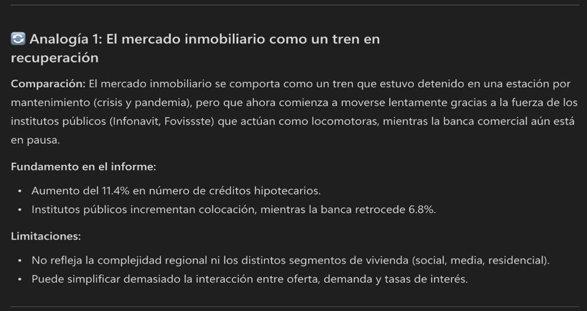

7. Aplique el siguiente prompt:

```

Crea un checklist de onboarding para una persona nueva que ingresa al equipo de análisis de riesgos de un banco.

•  Divide el checklist en tres bloques de tiempo: primer día, primera semana y primer mes.
•  En cada bloque incluye entre 5 y 10 ítems con tareas concretas, por ejemplo: accesos que debe tener, sistemas que debe conocer, documentos que debe leer, reuniones clave y actividades prácticas.
•  Marca con una estrella los ítems más importantes que no se deben omitir.
•  Al final, incluye 5 preguntas de autoevaluación para que la persona valore si su incorporación ha sido clara y suficiente.

 Presenta todo en formato de lista ordenada y fácil de copiar a un documento.
```
8. Observe el resultado que devuelve Copilot (imagen referencial):

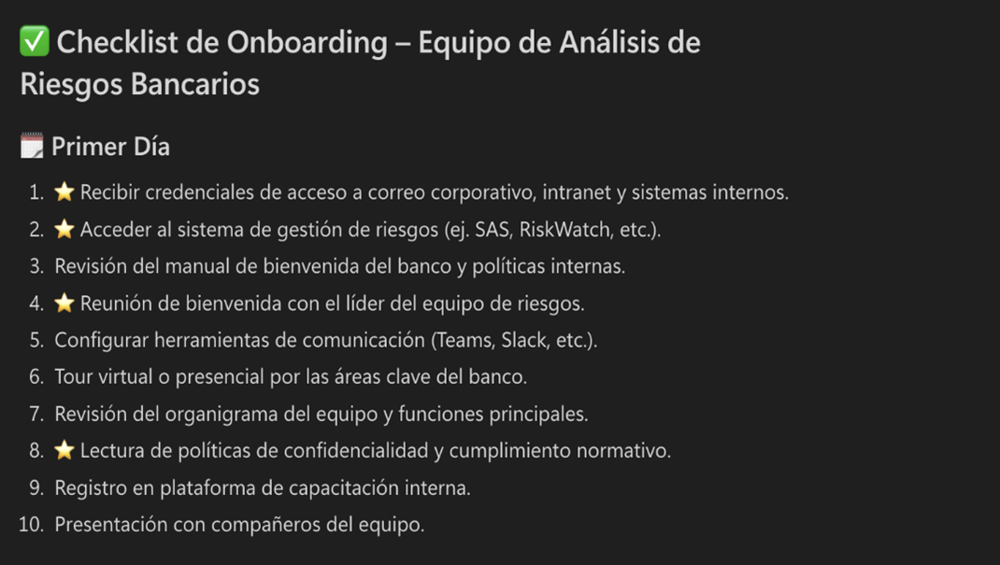


### Ejercicio 4:  Uso del agente Writing Coach

**Objetivo:** Usar diferentes agentes disponibles en el Agent Store de Microsoft 365 Copilot, empleándolos para diferentes casos de uso.


**Instrucciones:**

1. Abra Microsoft 365 Chat (https://m365.cloud.microsoft/chat)

2. En el menu Izquierdo lateral seleccionar la opción **All agents**. Se abrirá la página Agent Store, similar a que se muestra a continuación:


3. Seleccionar el agente Writing Coach.

4. Debe aparecer la página de agente Writing Coach.


5. Aplique el siguiente prompt:

```
Redacta un plan de proyecto completo para implementar un nuevo proceso digital de aprobación de créditos en un banco.

Estructura el plan con las siguientes secciones:

1. Resumen del proyecto: breve descripción de qué se quiere lograr.
2. Objetivos: al menos 3 objetivos claros y medibles.
3. Alcance: qué incluye y qué no incluye el proyecto.
4. Entregables principales: lista de resultados concretos (por ejemplo, proceso definido, sistema configurado, capacitación realizada).
5. Cronograma general: fases del proyecto y duración estimada de cada una, en formato de lista o tabla simple.
6. Roles y responsabilidades: quién participa (por ejemplo, área de riesgo, tecnología, operaciones) y qué papel tiene cada uno.
7. Riesgos principales: al menos 5 riesgos con su posible impacto y una acción de mitigación para cada uno.
8. Plan de comunicación: cómo se informará el avance del proyecto (a quién, con qué frecuencia y por qué medio).
9. Criterios de éxito: cómo se sabrá que el proyecto fue exitoso (por ejemplo, tiempos de respuesta, reducción de reprocesos, satisfacción de usuarios).

Usa un lenguaje claro y ordenado, con títulos y viñetas, para que el plan pueda copiarse directamente a un documento.
```

6. Observe el resultado que devuelve Copilot (imagen referencial):

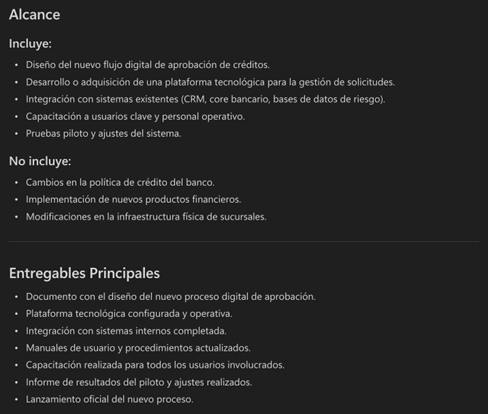

7. Aplique el siguiente prompt:


```
Redacta una política breve y un procedimiento simple para la gestión y protección de datos financieros de clientes en un banco.

•  En la política, incluye: propósito, alcance, 3–5 principios básicos (confidencialidad, integridad, uso correcto de la información) y roles principales.
•  En el procedimiento, describe en pasos: cómo se solicita acceso a los datos, cómo se aprueba o deniega, cómo se registran los accesos y qué hacer ante un posible uso indebido.

Usa lenguaje claro y formato con títulos y viñetas, listo para copiar en un documento.

```

8. Observe el resultado devuelto (imagen referencial):

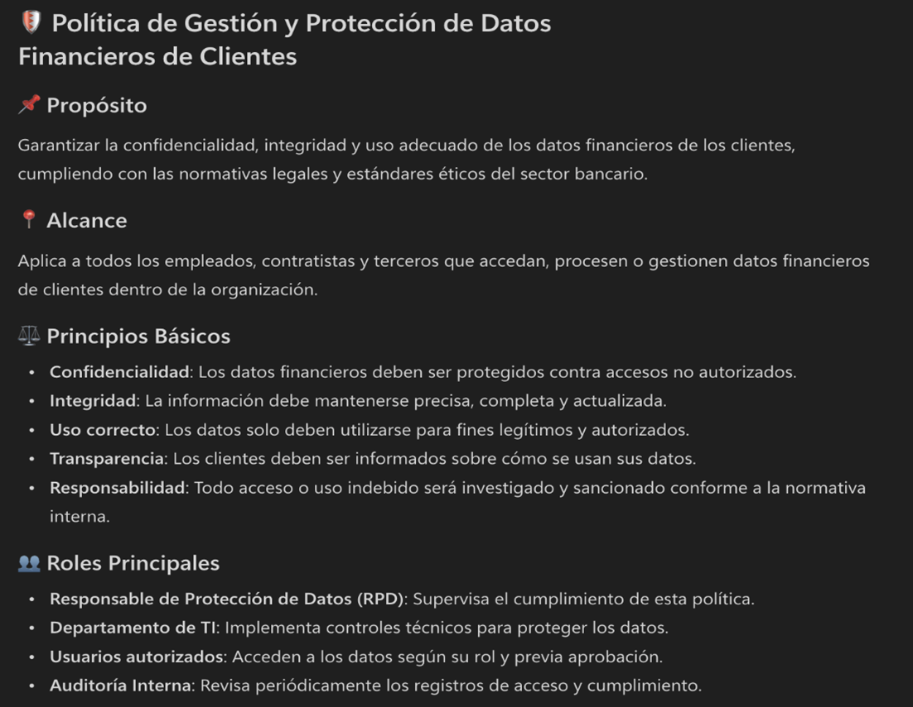

### Ejercicio 5: Uso del agente Skills

**Objetivo:** Usar diferentes agentes disponibles en el Agent Store de Microsoft 365 Copilot, empleándolos para diferentes casos de uso.


**Instrucciones:**

1. Abra Microsoft 365 Chat (https://m365.cloud.microsoft/chat)

2. En el menu Izquierdo lateral seleccionar la opción All agents. Se abrirá la página Agent Store, similar a que se muestra a continuación:

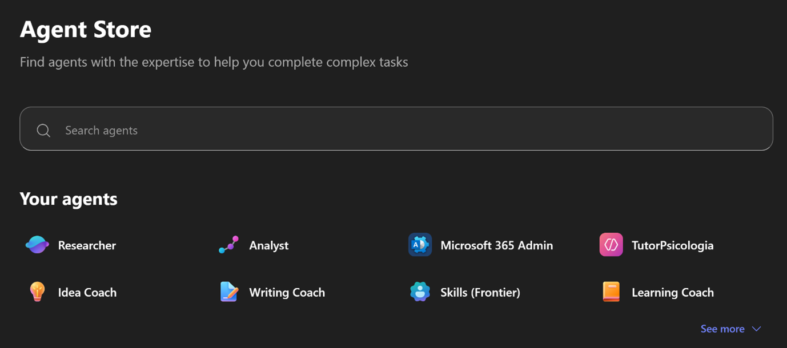


3. Seleccionar el agente Skills.

4. Debe aparecer la página de agente Skills.


5. Aplique el siguiente prompt:

```
Usando el PDF “Situación Inmobiliaria México – Primer semestre 2024”, crea un tutorial paso a paso para:

•  Identificar las secciones clave del informe.
•  Extraer los principales indicadores del mercado inmobiliario.
•  Resumir las conclusiones más importantes en una página.

Estructura la respuesta en pasos numerados, con pequeñas comprobaciones al final de cada paso para validar que el usuario esté entendiendo y aplicando lo que indicas.

```


6. Observe la respuesta que devuelve Copilot:

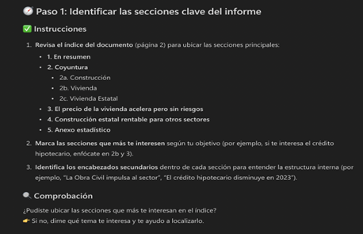


7. Aplique el siguiente prompt:

```
Diseña un proceso simple de aprobación de gastos para un banco.

Incluye:

•  Las etapas del proceso (solicitud, revisión, aprobación y registro).
•  Los roles que participan y qué hace cada uno.
•  Los rangos de monto y quién debe aprobar cada nivel.
•  Los documentos mínimos que debe adjuntar el solicitante.
•  Ejemplos de automatizaciones básicas (notificaciones, registro de estados, recordatorios).
•  Una lista breve de 3 a 5 indicadores para evaluar si el proceso funciona (tiempo de aprobación, rechazos, revisiones incompletas).

 Presenta todo con claridad, usando títulos, viñetas y pasos numerados.

```
8. Observe el resultado que devuelve Copilot (imagen referencial):

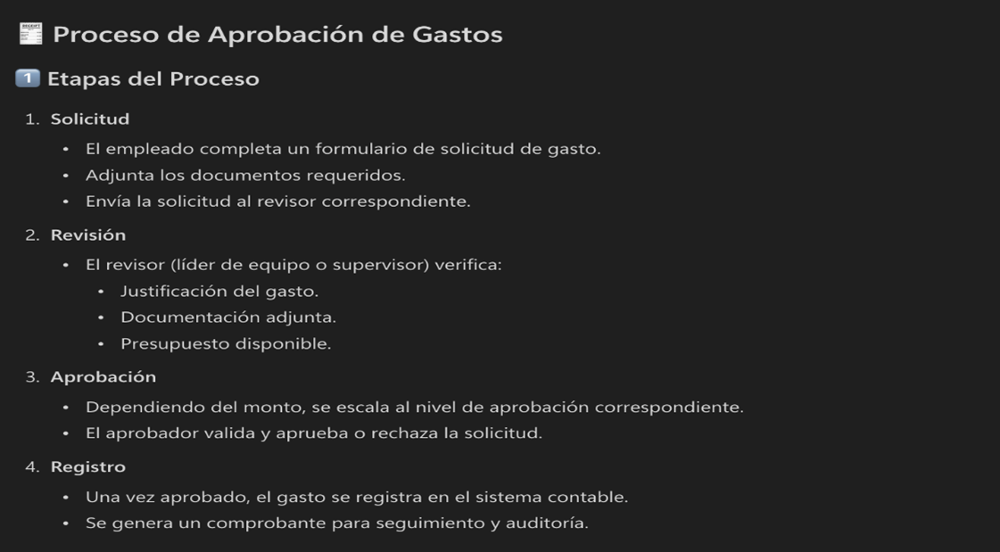

9. Ahora aplique el siguiente prompt:

```
Basándote en las estadísticas del informe de situación inmobiliaria que adjunto en este chat (PIB de la construcción, indicadores de vivienda y datos por región), crea un tutorial paso a paso para construir en Power BI un informe con dos páginas:

1. Evolución de los principales indicadores del sector construcción e inmobiliario en el tiempo.
2. Comparación de la oferta de vivienda por tipo y por región.
Indica con detalle:
- Cómo deberían estar organizados los datos en tablas y campos para poder usarlos en Power BI.
- Cómo importar esos datos a Power BI.
- Qué tipo de visualizaciones recomendar (gráficos de líneas, barras, mapas, etc.) en cada página.
- Cómo configurar filtros y segmentadores para analizar regiones, periodos y tipos de vivienda.
- Qué pasos seguir para guardar, publicar y compartir el informe con el resto del equipo.

Termina con una checklist corta de 8 a 10 puntos para comprobar que el informe quedó bien configurado
```


10.   Observe la respuesta que devuelve Copilot (imágenes referenciales):

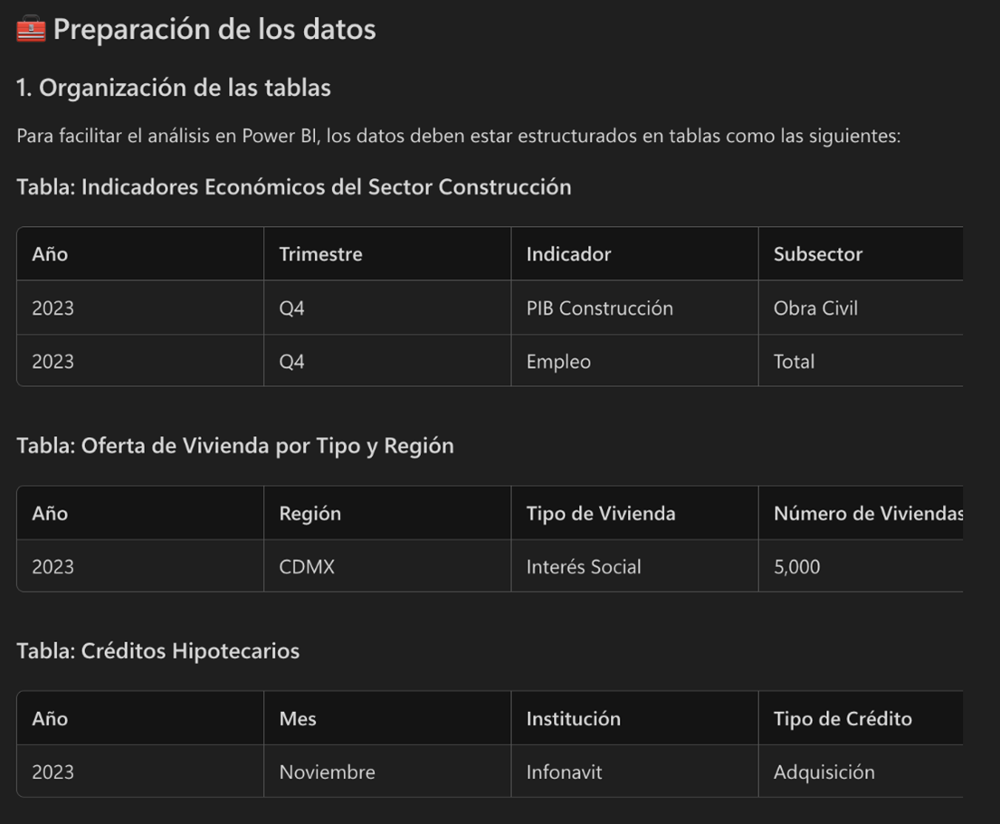

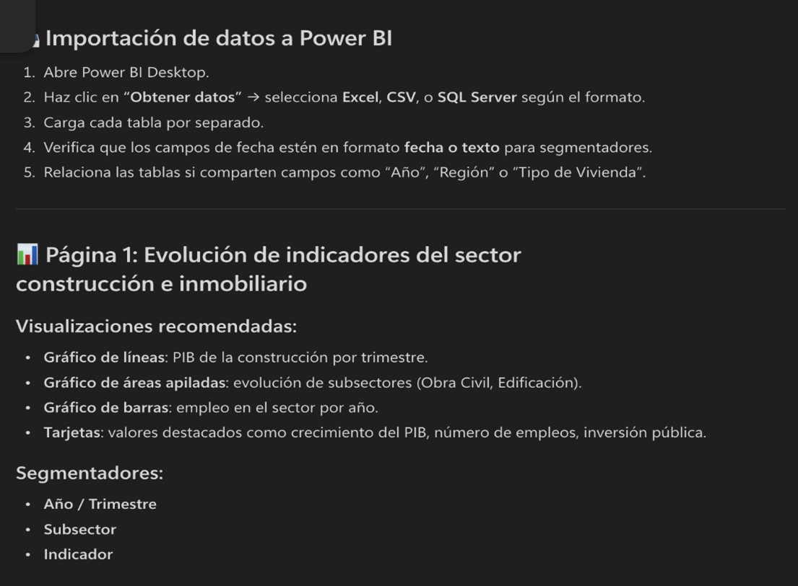

11.   Aplique el siguiente prompt:

```
Diseña un flujo de trabajo completo para la aprobación de solicitudes de crédito en el área de finanzas de un banco.

Describe de forma clara y ordenada:

1. Las etapas del proceso (por ejemplo: recepción de la solicitud, revisión inicial, evaluación de riesgo, decisión, comunicación al cliente).
2. Los roles que participan en cada etapa (quién hace qué) y sus responsabilidades principales.
3. Los criterios básicos de decisión que se deben revisar en cada etapa (documentos, montos, historial del cliente, etc.).
4. Las validaciones mínimas que deben cumplirse antes de pasar a la siguiente etapa.
5. Ejemplos de automatizaciones que se podrían implementar con herramientas de flujo de trabajo (por ejemplo, envío automático de correos, registro de estados, recordatorios).
6. Un conjunto de 3 a 5 indicadores para medir si el proceso funciona bien (tiempos, cantidad de solicitudes aprobadas/rechazadas, cuellos de botella).

Presenta el resultado de forma estructurada, con títulos y viñetas, para que se pueda copiar fácilmente a un documento.
```

12.   Observe la respuesta que devuelve Copilot (imagenes referenciales):


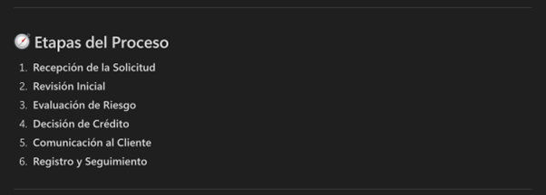

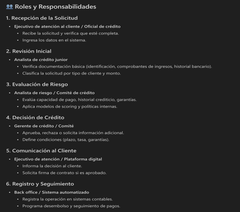

### Ejercicio 6: Uso del agente Career Coach

**Objetivo:** Usar diferentes agentes disponibles en el Agent Store de Microsoft 365 Copilot, empleándolos para diferentes casos de uso.


**Instrucciones:**

1. Abra Microsoft 365 Chat (https://m365.cloud.microsoft/chat)

2. En el menu Izquierdo lateral seleccionar la opción All agents. Se abrirá la página Agent Store, similar a que se muestra a continuación:


3. Seleccionar el agente Career Coach.

4. Debe aparecer la página de agente Career Coach.


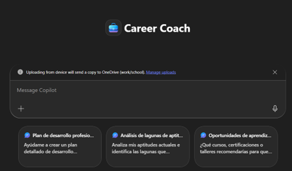

5. Adjunte su hoja de vida. Luego aplique el siguiente prompt:

```
Actúa como mi Career Coach y ayúdame a mejorar mi marca personal profesional, incluyendo recomendaciones para mi perfil de LinkedIn, narrativa profesional y preparación para entrevistas.
```


6. Observe el resultado que entrega Copilot. Refine el prompt si desea indicando su rol actual, funciones y habilidades, y vuelva a ejecutarlo de ser requerido hasta obtener una respuesta más precisa.


7. Aplique el siguiente prompt:

```
Actúa como mi Career Coach y ayúdame a identificar las brechas de habilidades entre mi perfil actual YYY y el rol al que aspiro que es XXX, proponiendo acciones prácticas para cerrarlas.
Nota: reemplace YYY por su rol actual y reemplace XXX por un rol al que aspire llegar
```

8. Observe el resultado que entrega Copilot. Refine el prompt y vuelva a ejecutarlo de ser requerido hasta obtener una respuesta más precisa.

9. Aplique el siguiente prompt:
```
Actúa como mi Career Coach y ayúdame a crear un plan de desarrollo profesional de 6 meses, alineado a mis objetivos de carrera, incluyendo habilidades técnicas, habilidades blandas y acciones concretas por mes.
```

10.   Observe el resultado que entrega Copilot. Refine el prompt y vuelva a ejecutarlo de ser requerido hasta obtener una respuesta más precisa.

### Ejercicio 7: Uso del agente Learning Coach

**Objetivo:** Usar diferentes agentes disponibles en el Agent Store de Microsoft 365 Copilot, empleándolos para diferentes casos de uso.


**Instrucciones:**

1. Abra Microsoft 365 Chat (https://m365.cloud.microsoft/chat)

2. En el menu Izquierdo lateral seleccionar la opción All agents. Se abrirá la página Agent Store, similar a que se muestra a continuación:


3. Seleccionar el agente **Learning Coach**.

4. Debe aparecer la página de agente **Learning Coach**.

5. Agregue el documento 6Situación Inmobiliaria México – Primer semestre 2024.pdf. Aplique el siguiente prompt:

```
Usa el documento PDF “Situación Inmobiliaria México – Primer semestre 2024” adjunto en este chat como fuente principal.

1. Identifica 3 conceptos técnicos complejos que aparezcan en el informe (por ejemplo, términos económicos, indicadores o métricas del sector construcción/vivienda).
2. Explica cada concepto dos veces: primero en lenguaje sencillo para alguien sin formación económica y luego con un nivel técnico intermedio.
3. Incluye un ejemplo numérico simple para cada concepto.
4. Termina con 5 preguntas tipo quiz para comprobar si se entendieron las explicaciones.
```

6. Observe el resultado que entrega Copilot (imagen referencial):

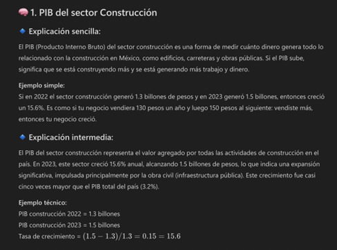

7. Aplique ahora el siguiente prompt:

```
Explícame de forma clara qué es blockchain en términos muy sencillos.

Después, muéstrame 3 usos concretos de blockchain en el área de finanzas de un banco (por ejemplo, pagos, contratos o verificación de identidad) y, para cada uso, indica:

- En qué consiste,
- Qué beneficio aporta al banco y a los clientes,
- Qué riesgo o limitación principal tiene.
```

8. Observe el resultado que devuelve Copilot (imagen referencial):


