### Laboratorio 10: Microsoft 365 Copilot: Crear un Notebook tipo LM

**Duración:** 26 minutos

## Descripción General
En este laboratorio, aprenderás a utilizar Microsoft 365 Copilot Chat para crear un espacio estructurado para resumir informes y mejorar ideas, uso de archivos y fuentes de datos.


## Objetivos de Aprendizaje
Al completar este laboratorio, serás capaz de:

•  Usar Microsoft 365 Copilot para crear un Notebook para resumir informes y mejorar ideas, usando archivos y fuentes de datos.


## Prerrequisitos

### Conocimientos Requeridos
- Conocimiento básico en el uso de documentos de Office

## Instrucciones Paso a Paso

En estos ejercicios se emplearán una serie de documentos base, que estarán disponibles en el One Drive de su maquina virtual de practicas.

Los documentos a disposición son los siguientes:

· 7Formativa_Temario_IA_Developer.docx

· 8Temario_Cloud_Developer_Azure.docx

· 9Temario_IA_Fundamentals_AWS.pdf

· 10Temario_IA_Fundamentals_Azure.p


### Ejercicio 1:  Creación de un Notebook

**Objetivo:** Usar Microsoft 365 Copilot para crear un Notebook para resumir informes y mejorar ideas, usando archivos y fuentes de datos.

**Instrucciones:**

1. Abra Microsoft 365 Chat (https://m365.cloud.microsoft/chat)

2. En el menú lateral izquierdo seleccione la opción All notebooks

3. Aparecerá la página de Notebooks (imagen referencial):

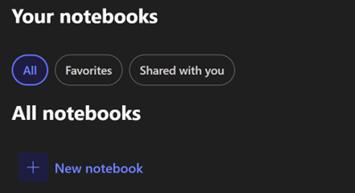

4. Haga clic en la opción + New notebook


5. Establece como nombre CursosNube

6. En la sección Add references, agregue los siguientes 4 archivos como fuente de datos del Notebook:
-  7Formativa_Temario_IA_Developer.docx
-  8Temario_Cloud_Developer_Azure.docx
-  9Temario_IA_Fundamentals_AWS.pdf
-  10Temario_IA_Fundamentals_Azure.pdf

7. Haga clic en el botón Create


8. Aparecerá la pagina del notebook creado CursosNube

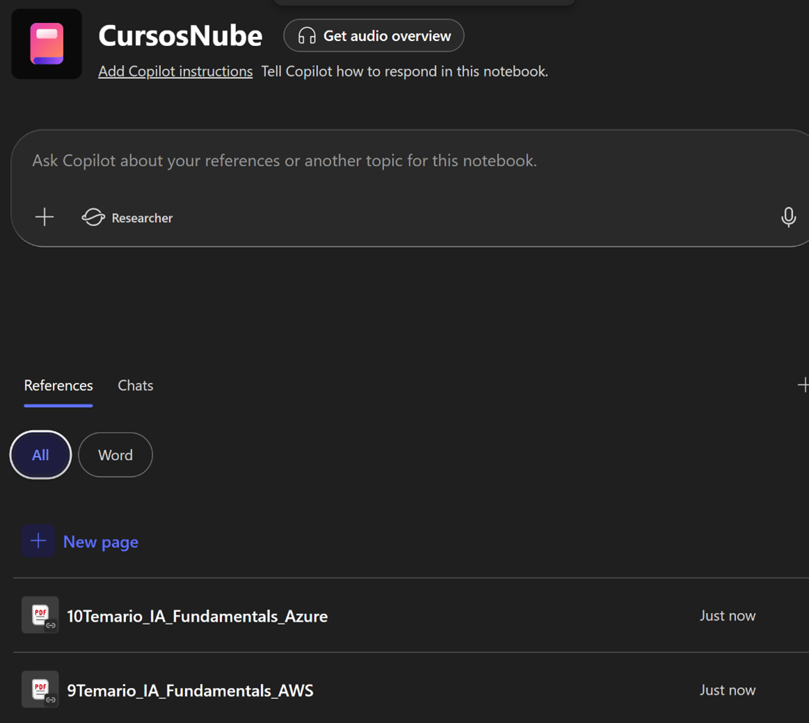

9. Seleccione el enlace Add Copilot instructions. Aparecerá la siguiente ventana (imagen referencial):

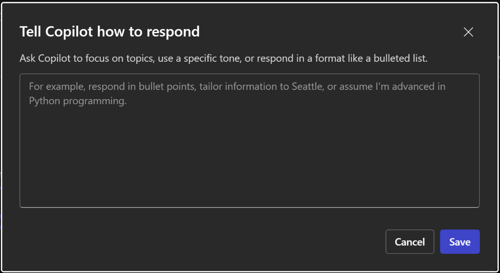

10.   Escriba el siguiente texto y haga clic en Save (imagen referencial):

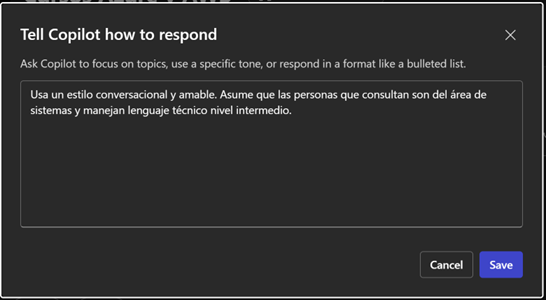

11.   De regreso a la página del Notebook, aplique el siguiente prompt:

```
Lista las capacitaciones disponibles que aborden la nube de AWS. Brinda los detalles de cada capacitacion.
```
12.   Observe la respuesta devuelta por Copilot (imagen referencial):

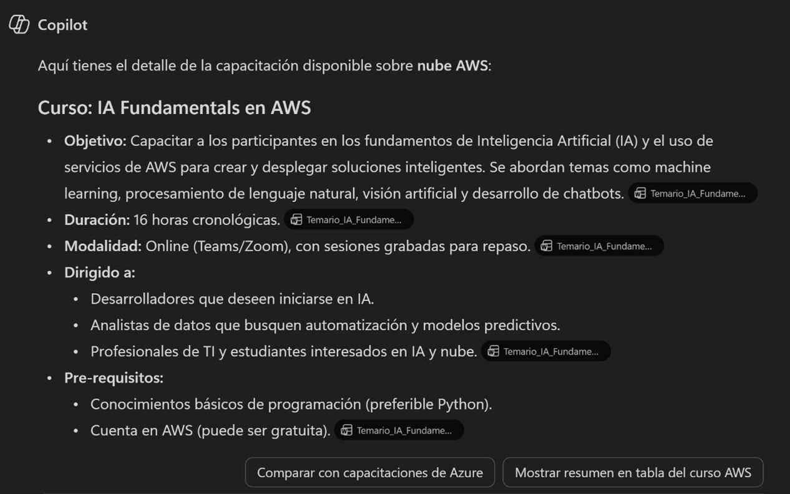

13.   En la parte inferior de la respuesta podrá ver las fuentes o Sources que fueron consultados para obtener el resultado mostrado. Si selecciona ese botón la lista de fuentes aparecerá en un panel derecho (imagenes referenciales):

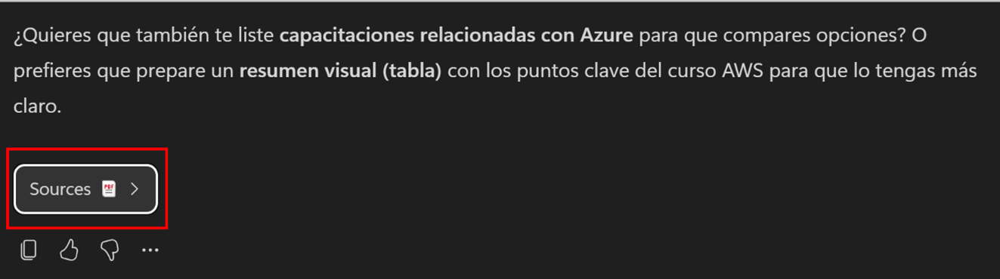

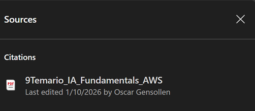


14.   Retorne a la página inicial del Notebook usando la barra de navegación superior izquierda:

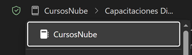


15.   En la zona inferior tiene la lista de recursos, así como el historial de chats que se han venido usando en el Notebook (imágenes referenciales):

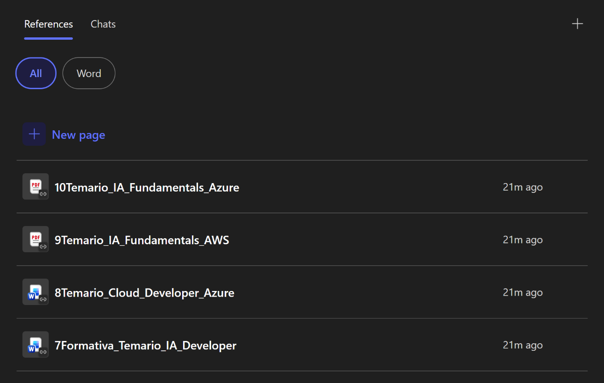

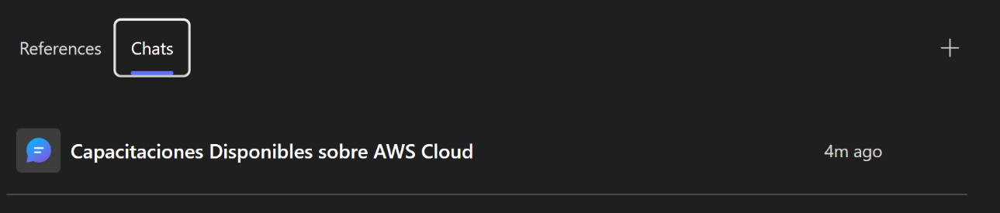

16.   Opcional: si las fuentes de datos son mas extensas o necesita una respuesta con mayor razonamiento puede usar el Agente Researcher para la generación de la respuesta. En la zona de prompt puede seleccionar Researcher. Luego defina los Sources (la web, archivos de trabajo del OneDrive, SharePoint, Correos, Reuniones, etc) (imagen referencial):

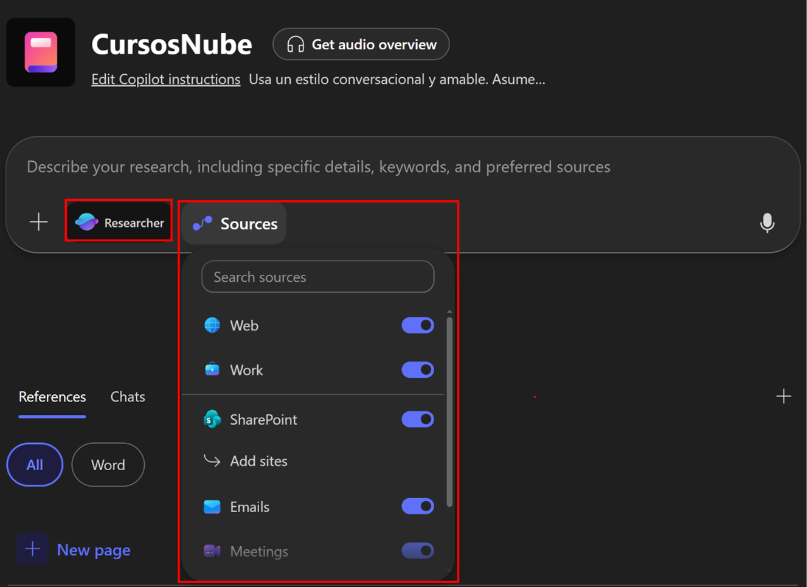


17.   Los Notebooks pueden generar un resumen de audio. En la parte superior de la zona de prompt seleccione la opción Get audio overview. Aparecerá la siguiente ventana:

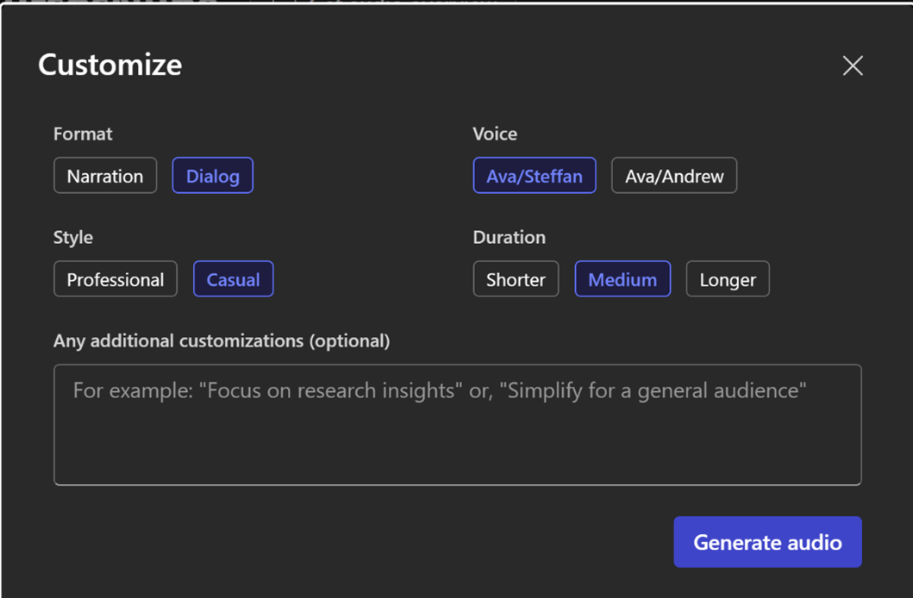


18.   Seleccione el formato, voz, estilo y duración que desee. Agregue como personalización el siguiente texto:
Usa términos simples para entendimiento de una audiencia amplia


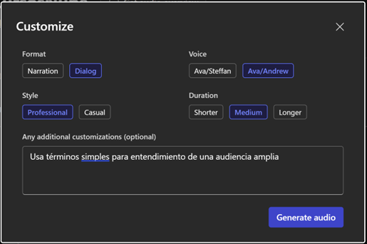

19.   Seleccione Generate audio. Espere unos momentos a que se genere el audio:

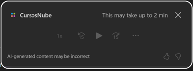

20.   Cuando termine la generación puede hacer clic en el botón Play. Escuchará una conversación en inglés (por el momento no se puede generar en Español) a manera de Podcast conversando acerca de los contenidos del Notebook, tal que puedan ser fácilmente entendidos por personas que quieran saber más del tema.


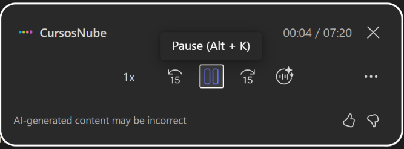
